**This article is a complement to my presentation in React Knowledgable.**

## Introduction

Artificial Intelligence is all the rage now, with the craze starting from Deepmind's alpha go. Although I hate people for misusing the terms "artificial intelligence" and "machine learning" for things that do not need AI and ML to solve, I do think that using AI reduces the time taken to solve certain problems, and also can add some "WoW factor" to an idea. I hope with this article (and subsequent presentations) people will understand what kind of problems that AI can solve, and maybe make AI more approachable so that the overall quality of hackathon projects improve.

First off, a disclaimer: **I am by no means an expert in AI. I do have an undergrad level understanding of artificial intelligence, but I was never great at it.** Feel free to correct me on any wrong concepts that I write in this article. I will also try to explain AI in English and not technobable, so for the real AI masters out there, you might cringe at me using wrong analogies or even butchering terminologies in an attempt to make AI easier to understand.

My motivation for this article stems from two comments that irks me. These (paraphrased) comments come from people who I think are smarter and better engineers than me. We are all front end engineers, and I can understand why they said it, but all these were in the context of Hackathons, and I feel that it's a shame for people to be limited in implementation just because AI seems so daunting.

> You can use my idea because I don't know how to build it

This came from a very creative person whose idea not only allowed me to win the second prize, they also won a consolation prize in their idea. People say ideas are cheap. That's half true. Yes, there is likely someone else who stumbled across the same idea and has the skills to implement it, but really most of the time we already have the capacity to build this idea, we just don't know it yet. 

> I wish I did more AI related things in University, I feel like I missed out

This is **the** comment that prompted me to come up with this article. I always wanted to present something about AI to my team, given that I do have *some* understanding of AI, but someone else did an introduction to Neural Networks that was more detailed than what I could come up with and I felt that that person would be more suited to carry on doing AI related talks. However from this comment I realised that **because** I am kinda shit in AI, but yet I know how to **use** AI libraries, I can add value to this topic. 

So here's what I hope people will gain from this article:
- Approaching Problems with AI
- What algorithms are good to google
- What can we achieve with just a surface level knowledge of AI
- Famous APIs that we can use for the next hackathon/prototype of things that we wanna work on

Here's what I will **not** go through
- How Neural networks work
- How to build an AI from scratch
- How to beat the no.1 go player with AI
- How famous algorithms work
- How to win a hackathon with AI

Mostly because I don't know the answers to any of the above.

Now this article will be written with FE developers in mind, with introductions to Javascript libraries. Many people would say that there are a lot of better languages for AI development and I entirely agree. There are some benefits to do AI in Javascript. Firstly, there's always the Nodes argument: your entire stack can be the same language. Whatever flavour of JS you are using, you can easily switch over from one to another. This is great for a quick prototype and/or proof of concept to show that your idea even works in the first place. Secondly for the users, you can have the entire script running on the browser. You can write some application once and run it anywhere, you don't have to worry about scaling as all the computation is running on the user's device. This also means you can have your application runnning offline, with PWAs. I think this is one of the strongest points we have for AI running on browsers. Finally, in terms of performance, JS is not much behind python, in some cases it might even been faster. It's really only a matter of time before the tools available for JS catches up to Python as the JS community grows larger and larger.

## What is AI

There are a few definitions of what AI is, and many of us get confused about the terminology. What is Artificial Intelligence and what is Machine Learning? Are they even different? The most sensible definition I found is that Artificial Intelligence is `Simulation of human thought processes in machines.` I find this to be very accurate. AI can be as simple as a bunch of if-else statements (that's essentially a `decision tree`) or something as complicated as simulating a brain (`neural nets`). Machine learning is a subset of artificial intelligence, and basically what ML does is to write a program to find patterns in data, without being explicitly written which pattern to recognise.

Now in my own understanding, we really just want to solve three different types of problems:
- Categorise things
- Make Decisions
- Generate things

These groups of problems are actually not how actual AI-savvy people group them, but I find these approach of grouping problems easier to use to visualise solving some problem with AI.

These problems have to be represented by some form of data, so that's something that usually requires some level of intuition and experience, but after a while you might start recognising certain methods people use to represent different data. For now, let's assume that all real world data come in the form of numbers stored in some variables.

## Categorising problem

For the first type of problems, we can imagine a mathamatical function. Suppose we want to guess: given a Merge Request (Pull Request) how many people will actually do a MR vs giving a "free" `LGTM`? In this case, maybe a point of interest would be the length of the MR by lines of code changed. We can expect that with more lines, the more likely people will `LGTM` it without reading it. Now maybe a second point of interest that we want to do is how many files have been changed. Now if there's very few file changes, the code change is easier to understand, and people will tend to actually review the code compared to MRs with lots of file change. So we end up with something like this:

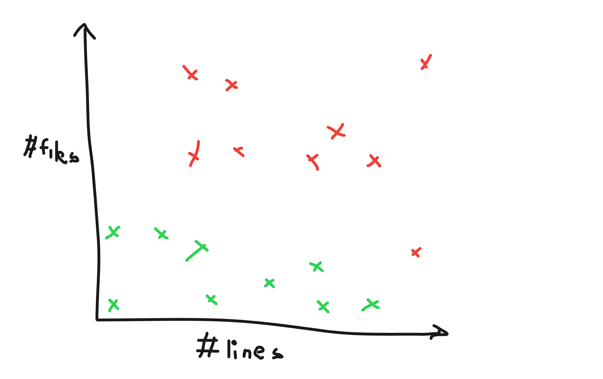

So what we want our algorithm to do is to draw some line such that everything above the line belongs to `LGTM`-ed category, and everything below the line belongs to the `actually been reviewed` category. So we pass these data into some categorising function and it will generate a best-fit line. Now whenever we want to categorise a new MR, we just plot it on the graph and check its relation to the said line like so:

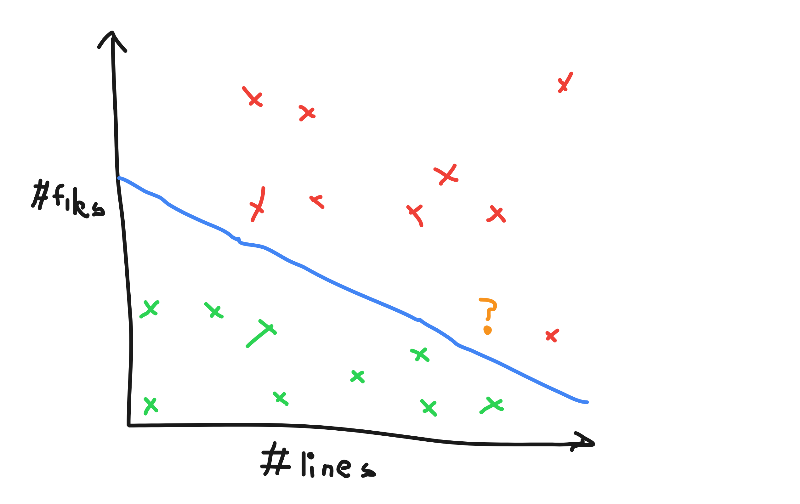

But that is just two variables, what if we want to have a third variable? Like for example, how near is the deadline? The nearer the deadline, the more likely someone will skim through it, the further it is, the more likely someone will read it through. Well for 3 parameters, we can actually visualise it as a point in a 3-dimensional space. Instead of a line, we will separate the dataset with what we call a plane (that is, a 2-d surface that extends indefinitely), like so:

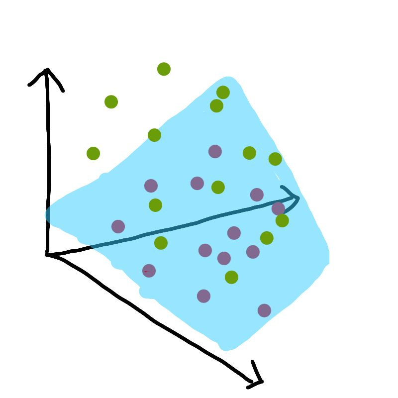

If we add another variable? Easy! Make it four dimensional, or five, or six or however many variables you need. In ML we call these variables `parameters` and we call the thing separating the different categories the `hyperplane` (subspace whose dimension is one less than that of its ambient space). Not all categorising algorithms work like this, but this is a way to visualise your problem that you want to solve.

## Decision making problem

Next kind of problem, we have decision making. Essentially, given some number of choices, we want to be able to choose the most desirable option. A case study for this kind of problem would be something like a Tetris playing bot. Let's establish some rules of the Tetris that we're going to analyse. This will keep our problem scope smaller and easier to analyse.

- your score is how many lines you clear (one line, one point)
- how fast you make the move doesnt matter
- you only know the current piece, and the current state of the game

So let's think, how we would want *a robot* to play this game. I added the words *a robot* there for one simple reason. We don't want to care about things that will affect us emotionally. We are aware that the game gives us four points if we clear four lines in one go, and four points if we clear four lines individually, but for us it will feel so much more satisfying if we were clearing four lines at one go. Similarly, we don't want the robot to care if making the optimal move makes the state of the game look "ugly", we only care if its the best move at the current point in time.

What we'll do is given a current state of the game, we want to place the moves in every single possible(legal) ways and then use some method to gauge if a move is good or not. So what is this method? We will take the state of the game, and then come up with some numbers to represent a desirable trait or an undesirable trait. We will then sum up the desirable traits, and minus the undesirable traits to get a score. These traits are known as `heuristics`. Heuristics give us some interpretation of how good a decision is, and more importantly, they are usually fast to calculate. Of course, some traits are more important than others, so we need to multiply them by some constant value. These constant values are called `weights`. We can throw the weights into some classification algorithm to optimise what number is better, so we don't need to care about what the numbers are for the sake of this article.

Let's think of the first heuristic we care about. Of course we want to clear lines, and even though clearing more lines doesn't give us more points, but it makes the game last a little bit longer, so let's just count if there are lines cleared or not this turn:

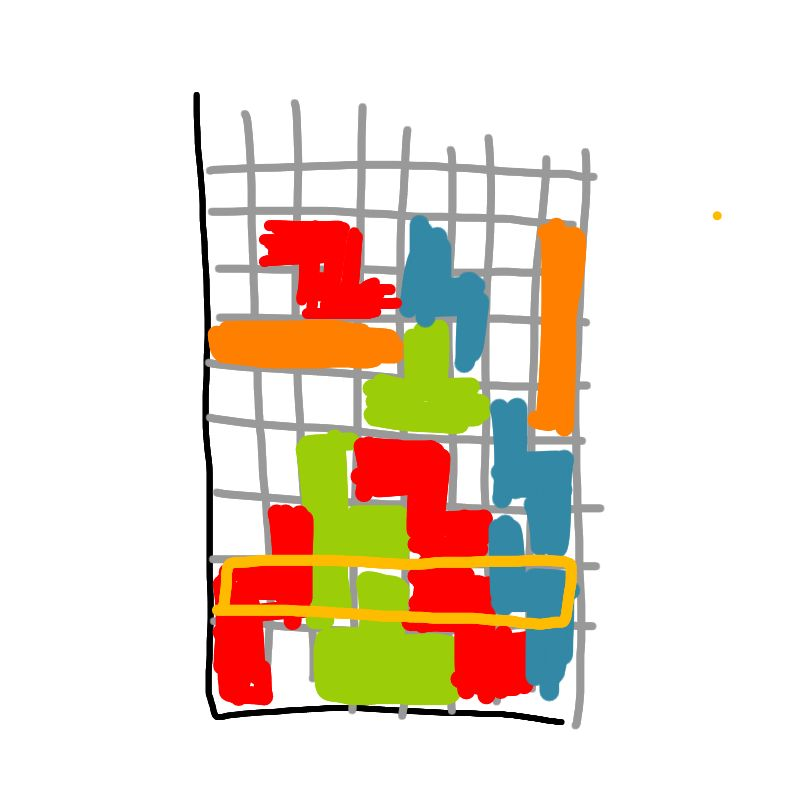

Next thing, we want the robot to play as many moves as possible, so that it has the most chances to clear lines, we don't want the bot to make an optimal move it that ends the game right now. So let's take something like, the current height of the game like so:

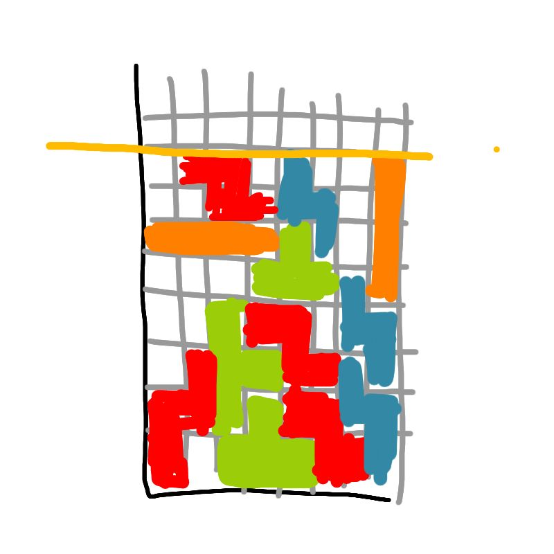

Now this is good, but suppose we have just one line that's really tall but doesnt lose immediately, that's not entirely bad right? So maybe we can do something better. instead of just height, let's sum up the height of each individual column, like this:

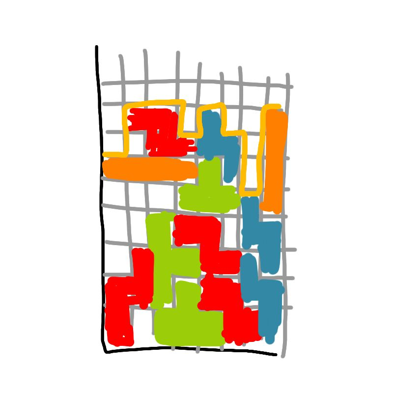

Finally the biggest bane of Tetris is to have a "hole" right? it's bound to happen but we want to reduce the number of holes. Lets count the number of holes and then multiply it by a some negative weight:

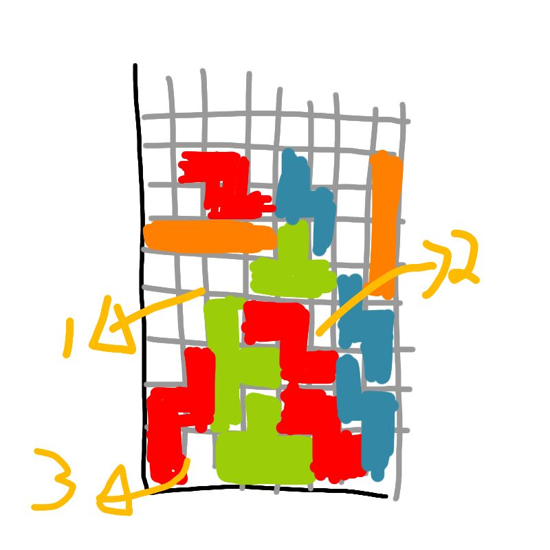

But it's not neccessarily just holes, overhanging piece will eventually create holes (assume no T-spins and no "sliding" at the bottom) so we want to count that as well. And a hole with more overhang is worse than a piece that just overhangs. So let's do something like this:

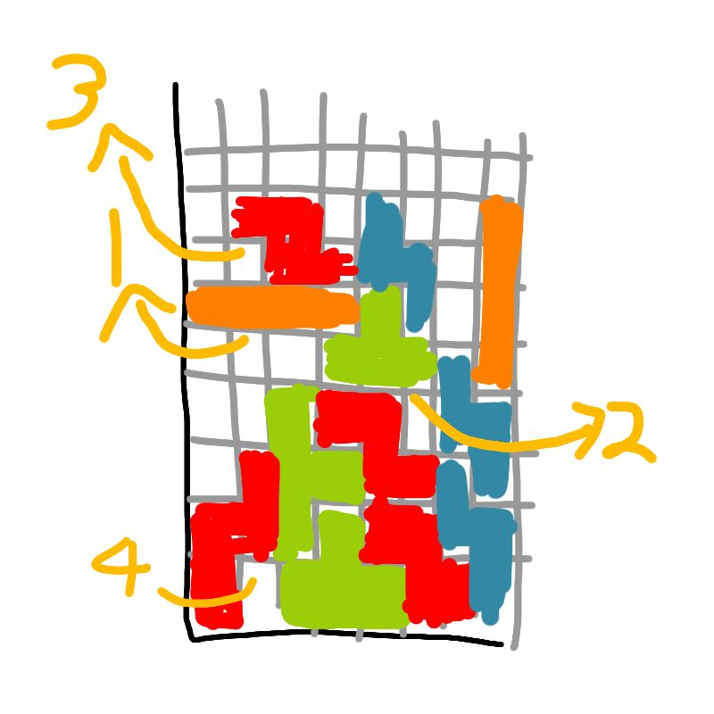

If we look at the previous two, isn't the hole count really some subset of the overhang count? So maybe we can do something better. How about if starting from bottom, we add a count everytime we go from "solid" to "gap" this way we can actually detect when there are a lot of small gaps, as small gaps take more moves to solve but big gaps could be solved easier.

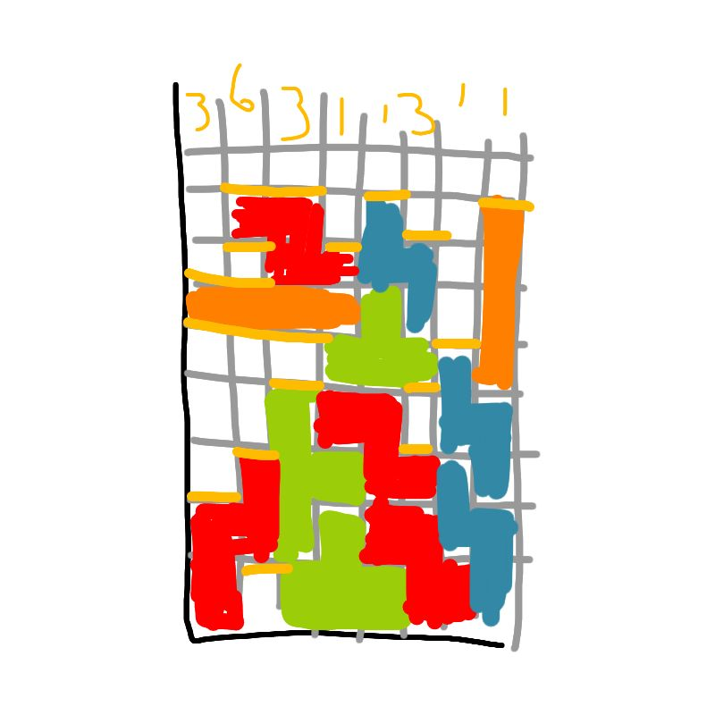

But I think we can do better. This heuristics takes care of how many gaps there are in the same column, but it doesn't really have a big picture representation of how sever a gap is. A gap with many bends is much harder to solve than a 'smooth' gap. A heuristic that can take this into consideration could be something like how many 90 degree bends there are in the state.

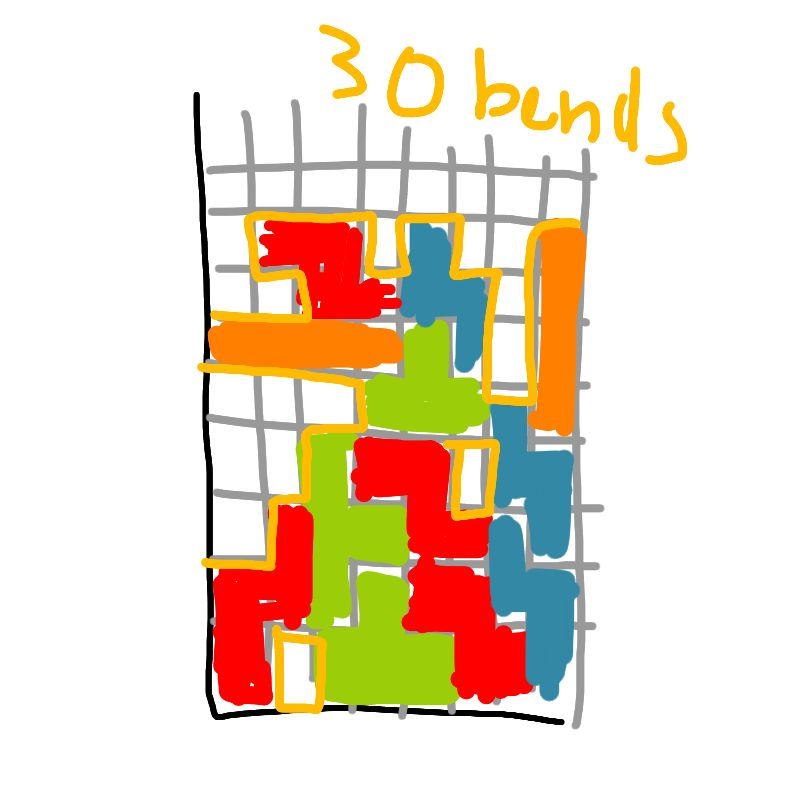

Summing up the heuristics and then multiplying by some constant weights to them, we have something like:

```latex
c_1 * linesCleared + (-1 * c_2) * sumColHeight + (-1 * c_3) * numBends
```

So now we have a bot that analyses Tetris like how an almost perfect human would, except the analysis needs to be weighted. All details aside, we can look for some algorithm that takes in `c_1, c_2, c_3`, runs a game of Tetris, gets the score, modifies `c_1, c_2, c_3` a little bit and runs the game again. rinse and repeat until `c_1, c_2, c_3` is fairly stagnant, or you don't have time to train anymore. In unviversity my teammates used a library which provided something called `particle swarm optimisation` which brought my team's AI score up from ten thousands to millions just by running a optimisation algorithm on the weights.

## Content Generation Problem

For the final type of problem, unfortunately there are too many different ways for diffent domains. Generating an Image is quite different from generating sounds or text. There is some headway being made in the form of neural networks which pit two neural networks against each other, but that's a whole new article and presentation. However for text generation, there are some probability-based state machines (known as `Markov model` or `Markov process`) that is easy to program, and also gives us reasonable results.

I won't go through the process of writing a `Markov model` but the general idea for text generation will be something like. "What is the most likely word to appear next, given that the words before are `a` and `b` (and `c` and `d` etc etc etc..)?" So what we will do is to find a markov model, and find sufficiently big dataset. An example that I want to use is something like a Donald Trump text generator. 

First things first, I need a dataset. In the domain of Natural Language Processing, we call a file with lots of sentances a corpus, so I found [1mb worth of trump speeches](https://github.com/ryanmcdermott/trump-speeches) from [@ryconoclast](https://twitter.com/ryconoclast). We can do some cleanining up of the data, like changing all text to lowercase, and grouping words that come from the same word together(`stemming`, eg: consultant, consulting, consults -> consult) but I won't be using it for my example, just to showcase how decent the results are without much effort.

After finding [a tutorial on how to do exactly trump speech generators](https://medium.com/@corrigan1247/how-to-imitate-trump-with-markov-chains-8224877dcf69), I passed in the entire text file into the function, added some checks to make my generated content at least 20 words long, and this is my result:


Not too bad, but a little bit random right? If you did read through the tutorial on building Markov chains, you might guess why. If not, the general idea is that we are only looking at some word `a` and getting a list of words that come after `a`, and choosing a word randomly from there. This is kinda funny but not really as fluent as we like it to be. So I did some modifications and made it such that we get a sequence of `x` number of words to generate the next one. So here's one where we look at the previous 2 words:


Pretty good! increasing the number of words we reference:

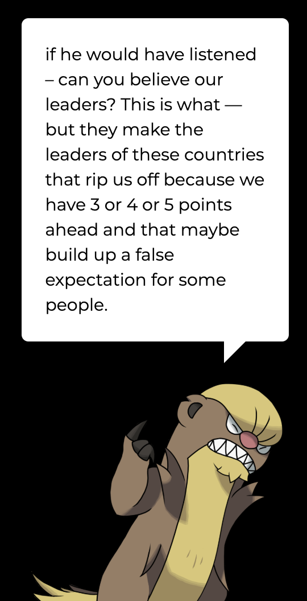

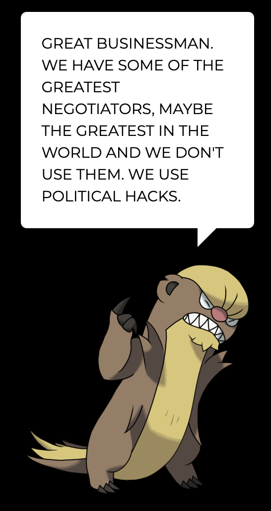

Woah, that last one seems a bit too on the nose doesn't it? That's because it's directly lifted from the source.

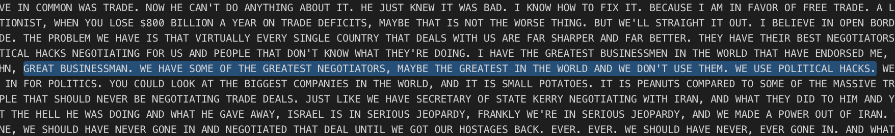

So here lies a decision we must make. The more fluent we want our robot to be, the more previous words we want to use to predict the next words. However the more words we use, the more we directly lift from the source text. I find that a good number of previous words to look back on is between 1 to 3. You can try the [gumshoos speech generator](https://httpserve.tenzhiyang.com/gumshoos/) with 2 previous words (bi-gram).

That's three different case studies of analysing three different AI solvable problems, (mis)quoting portal: now you're thinking in AI, with this Part 1 I hope you manage to gain some insight on how people approach real world problems and breaking them down into numbers, then trying to solve it in one of the three above methods. It comes with practice and there are definitely more than one way to categorise, make decisions or generate problems, so keep at it, get to know more AI tools available and you can evantually make great AI applications in a short period of time!
