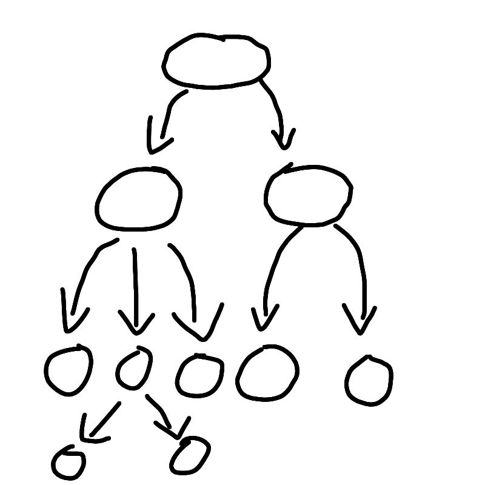
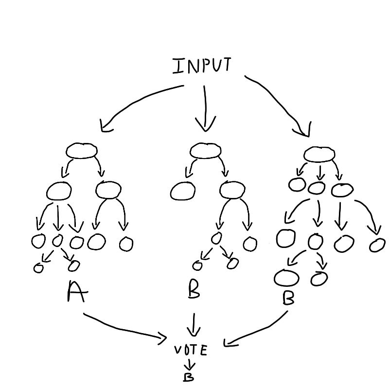
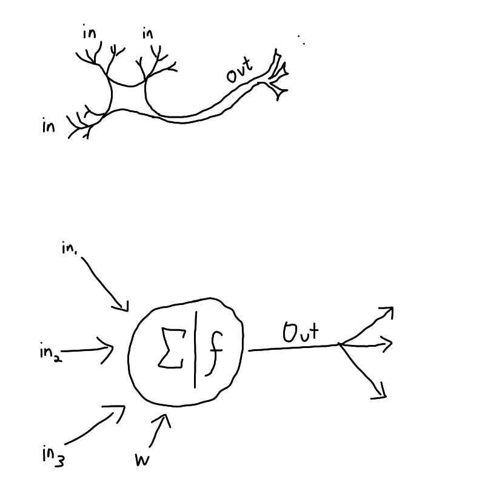
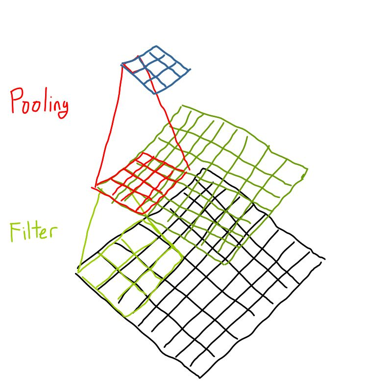
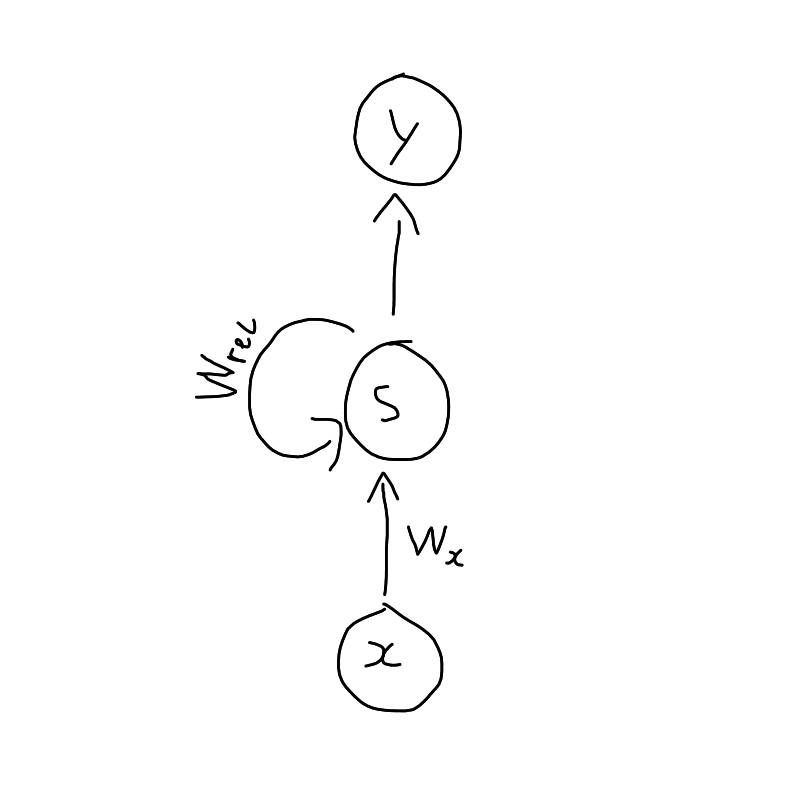

## [Part 1 here](https://blog.tenzhiyang.com/2019-07-31-ai-for-fe/)

**This article is a complement to my presentation in React Knowledgable.**

Now that we know how to approach problems, we can look at what's available. For this section I want to go through some big idea explanations of algorithms and what kind of input/output you can expect from and their implementation from the web. The goal here is that whenever you see a problem that you want to solve with AI, you have a rough idea what to Google, and how to transform your data to pass into these algorithms.

## Fantastic algorithms and how to use them

### Markov Process (Markov Models)

Part 1 made use of a `Markov Chain`. The main idea for how Markov Processes work is that the future state is based on the current state and nothing more. We can define what is the "current" state like how we did with the text generation, where we defined the "current state" as the recent two words to predict the next word. Markov Models are great if you have lots of data with relatively few "states". So how do we define what is a 'state'? Basically the very thing that you want to be predicted from a Markov model. Since the English language has 171,476 unique words (according to a Google search), it is a relatively small number of states. This is why Markov models are used very often in text prediction, such as those in your android and iphone keyboards.

Implementation details may vary, but the general idea is to take a series of `A -> B` (A leads to B, or mathematically, A implies B) and passing it into a Markov Process. If you are dealing with something like a source text, where the states can be very long strings like `A -> B -> C -> ... -> Z`, you can just pass the whole data into some Markov chain library. Another example that isn't text is something like weather prediction. If it has been raining today, it will be less likely to rain tomorrow. So you can just pass the weather over the past 10 years or so in the form of `sunny, cloudy, rain, rain, sunny, ..., sunny` into the Markov process. After the data transformation is done, given the current weather, you'll get a prediction of what's the next weather. 

As you might observe, real life is not so obvious that you can predict X given Y and get a correct prediction all the time. Hence Markov processes are very useful for problems that give you a list of what's the probablity of things happening after Y has happened, and a user makes an informed decision. Alternatively it can also be used for things where randomness is a bonus side effect, such as in the text generator, where I just chose a random word from the list of X predicted from Ys.

### K Nearest Neighbours (KNN)

This algorithm is a very simple one. Going back to our 2-dimensional space of data, we plot all these points on the graph, and then we add a label to each one. There's no calculations being done during the "training" time, it's just plain data entry. So when we actually need to classify a new point, what we do is that we iterate through all the data, and then we find the K (some constant that you will input) nearest neighbours, using a simple straight-line (Euclidean) distance calculation. To use a KNN library, you should really only need to pass in the parameter and the label. Just note that some libraries do not accept negative parameter values.

The great thing about KNN is that adding data really doesn't cost anything at all, as there's no computation. KNN scales linearly with large number of data, and large number of parameters, and this calculation is only done during the categorising process.

### Random Forest Classification

Random forests comes as a variant of `decision trees`. A decision tree is built using some source dataset, split based on some rules based on the parameters. Each split that we make creates a "branch" with some probabilites on each branch. Eventually all branches have smaller branches until we form what looks like an upside down tree: 

A random forest is just the same process, but splitting the data into random subsets of parameters, and creating a separate tree for each of them, hence the term Random Forest Classification. The algorithm will then return a list of different classifications with some number from 0-1, this number is known as the `confidence` for the purpose of this blog post, you can think of confidence as exactly what it sounds like: how confident the algorithm is that this is the classification.

One great thing about Random Forest Classification is since you have a list of results of different confidences, if you have non-mutually exclusive groups to classify into (eg: it can be **both** raining and sunny), you can choose to accept results above some level of confidence. Random Forest algorithms normally take in an array of parameters and an array of output. The parameters need not be the same length, but parameter order matters if you want fairly accurate (greater than 90 percent) results. The output order doesn't matter for most implementations.

### Neural Networks

The absolute coolest kid on the block, nerual networks has already been explained in a previous talk, but the general idea is that we are trying to simulate how the brain works. Starting from a neuron, each neuron takes in a large number of inputs, multiply each input by some number (called weights, which define how important each input is), sums these inputs together, runs a type of mathematical function (called activation function) such that the result is between 0-1. The output of this neuron is then passed to another neuron, and so on and so forth. Each group of neurons that passes on to the next group of neurons is known as a "layer". See how similar a NN neuron is to a brain neuron:

The training algorithm will take in some input and pass it through the neural network, with all the weights randomised, and gets a prediction, which can be one or more numbers, depending on how many labels you want. It will then use the correct label and compare with the current label and tweak the weights such that the next time we pass the input, we are more likely to get a result closer to the correct label. We don't alter the weights such that it definitely gives us the correct label because we do not want the neural network to only work on the training set, we want it to work in real life scenarios with ambiguous input that is similar but not exactly the same with the dataset.

I don't recommend training your own neural network when you're just beginning as you need a huge amount of data (at least 500 samples of each label) and creating a neural network is really more of an art than science. It takes experience and some intuition to really know how many layers and how big a layer you want for a neural network. However, there's proably a pre-trained model that solves your problem, and using it should be easy enough, just that every model has different requirements. You'll need to read their respective documentation to use them.

### Convolutional Neural Networks

The idea of Convolutional Nerual Networks is simple in implementation but not very intuitive to understand. Basically for an image, each pixel is a parameter (or rather, 3 or 4, with Red Green Blue and transparency values). You can **technically** pass in the entire image into a Neural network, but it usually doesnt work out well, as a normal neural network does not understand the relations between pixels. Another problem is that having each pixel as a parameter is too large an input and would take forever to train.

This is where the convolutional layer and pooling layer comes in. Basically the convolutional layer applies a filter, which transforms `n * n`pixels (a square) into 1, using some matrix manipulation mathemagic. The pooling layer comes immediately after the convolutional layer, and its job is to reduce the input space further, by taking the max or the average value in `n * n` pixels. These are called `Max Pooling` and `Average Pooling`. Max pooling by nature tends to reduce noise in the data while Average pooling is a simple `dimension reduction` (reducing the input size by `x` dimensions). The two layers together will be inserted in between some layers of a nerual network. It is possible to have more than one such convolution+pooling layer, but that increases computation time.

There are plenty of pre-trained convolutional neural networks that recognises objects, animals, drawings or even individual hand written characters, so if you just need to identify what is inside an image, you can leverage on the existing neural nets to classify what you need. For example, during the most recent hackathon I wanted to know if the user has drawn a circle, square or diamond, my team used Google Quickdraw's net to identify what it was and re-draw a perfect circle square or diamond in its place. I did some additional neural net on top of that, which causes the lag, but you can try it [here](https://hackathon.flowdi.tenzhiyang.com/).

### Recurrent Neural network

As you might notice from the Neural networks and CNN sections, the way we simulate the human brain may be a bit simplified, and RNN aims to improve on one aspect. Recurrent Neural Networks aim to add a "short term memory" by making each neuron pass its output back to itself, for the next computation. This allows information to persist inside the network where the previously input data will affect the next few predictions. There is a commonly used variant of RNN called Long Short-Term Memory (`LTSM`) network which works differently but produces better results.

The nature of having some form of short term memory makes RNN especially useful for things like speech recognition, language modeling, image captioning or even some time-based data (known as `time-series`) such as stock price of a company. I haven't really used RNN yet, but it's good to know what its capable of.

### Transfer Learning

Earlier I mentioned about not training your own neural network because it (probably) already exists, but here's something we can do to make a neural network solve more domain specific problems. Transfer learning is basically using an existing neural net, and training the top (few) layers of the neural net, so that you retain the pattern-recognition capabilities of your neural network, but optimised to your specific problem. There are plenty of tutorials and methods differ between various libraries, so I won't go into the details of its implementation.

However, one interesting take on transfer learning was something I learnt from the [tensorflowjs transfer learning tutorial](https://www.tensorflow.org/js/tutorials/transfer/image_classification). Essentially what this method does is that it takes a representation (they call it an `activation`) of the neural network, and uses it as the parameter of a K-Nearest Neighbour. I asked some data scientist friends of mine and they have confirmed that this is not really a traditional implementation of transfer learning, although it's a fascinating idea.

The idea behind this concept is perhaps best explained in an example. [This Project](https://httpserve.tenzhiyang.com/imageRecognition/) uses image net, which is trained to recognise object from images. Even if the net is not trained to recognise something, for example which direction my head is facing, when the image changes drastically, there are some neurons in the network that will have a high value and some neurons that won't change at all. Therefore knowing which are the "triggered" and "non-triggered" neurons as parameters, we are able to categorise new objects using KNN, using a model that learnt from another data set.

## Example Projects

Here are a few projects that I've been doing in the past couple of weeks, where each project takes about a couple of hours to build, I do try to add something on top of just consuming the API, so that you can catch a glimpse of how I make use of existing tools to do something else instead of following tutorials or documentation to solve a problem that someone has already solved before.

All of these projects are running entirely on the front end, they are all static sites served off a simple HTTP server.

### [Gumshoos](https://httpserve.tenzhiyang.com/gumshoos/)
- Time taken: 45 mins, of which maybe 30 was looking for a super simple no frills implementation of markov chains.
- Libraries: `nlp_compromise`

### [Image Recognition](https://httpserve.tenzhiyang.com/imageRecognition/)
- Time taken: 1.5 hours, half of the time spent following the google codelab tutorial
- Libraries/models: `tensorflowjs` `mobilenet` `knn-classifier`

### [Green Screen](https://httpserve.tenzhiyang.com/greenScreen/)
- Time taken: 1.5 hours
- Libraries/models: `tensorflowjs` `body-pix` `jscolor`

Body-pix is a model that is used for segmenting body parts in an image. I made use of a function `toMaskImageData` which basically gives me a "silhouette" of a person in the image. I use a few composite methods available from the canvas context api (webcam input, overlay silhouette with `destination-in`) to remove the background. Then green screen in the background is really just setting a background color. Theoretically we can overlay the greenscreen effect over anything, as long as they're both in the same webpage.

### [Mocap](https://httpserve.tenzhiyang.com/mocap/)
- Time taken: 1 hour
- Libraries/models: `tensorflowjs` `posenet`

I really didn't do anything for this. Passing in the webcam-feed into `posenet`, I receive a list of bodyparts followed by their x and y coordinates and a confidence score. Next, I drew red squares where each body part was. I can go a step further to remove those body parts with low confidence, but that's just from analysing the input and output and using some constant value that works well enough.

### [Jojo's Bizarre Poses](https://httpserve.tenzhiyang.com/jojoPose/)
- Time taken: 1 hour (excluding the time required to build mocap)
- Libraries/models: `tensorflowjs` `posenet` `knn-classifier`

This is like a combination of `mocap` and `image recognition` projects above, but since the KNN classifier I used was from the tensorflow libraries, it takes in a certain data type `tensors` as input. I had to modify the data to fit the KNN classifier.

## Some useful tools

What I went through in the past two blog posts cannot possibly cover all the use cases you might want to work on, so I've decided to compile a list of useful libraries and data sets that you can use in your own personal projects.

### Some famous Datasets

- Brown Corpus

Known formally as the **Brown University Standard Corpus of Present-Day American English** this dataset contains about 500 samples of English-language text and is used frequently in NLP projects.

- Quick draw

Remember [this game](https://quickdraw.withgoogle.com/?locale=en_US)? It was a data collection exercise, and they've open sourced all the drawings together with the draw order!

- ImageNet

A database of pictures that are labeled by crowd-sourcing, this dataset contains more than 20,000 categories, with bounding boxes to highlight the objects being labeled.

- MS-COCO

**Common Objects in Context**, this is a dataset of common objects are taken from every day scenes. Instead of bounding boxes like in ImageNet, they have object segmentation, just like my green-screen example, but for objects.

- MNIST

MNIST database (**Modified National Institute of Standards and Technology** database) is a database of handwritten digits and is used very frequently to practice creating handwritten character recognition algorithms.

- Free Spoken Digit

This is the MNIST of Speech recognition basically.

- Free Music Archive

Just an archive of royalty free music!

### Some famous Libraries

- ML.js

The scikit AI toolset, now replicated in js, has lots of learning algorithms and some useful data transforming utilities.

- compromise

A fast NLP library which helps format text. Uses some outdated techniques in favour of speed over accuracy, aims to solve 90% of use-cases.

- Tensorflowjs

A re-write of the famous tensorflow in js. There's quite an established community supporting and I can find very good models written for or compatible with Tensorflowjs

- Kerasjs

A fairly popular neural network library, the models produced by Keras can be imported into Tensorflowjs also.

- ML5

Another Nerual Network library. It is actually a high-level interfact for Tensorflowjs. I've heard that ML 5 has more beginner friendly jargon and documentation, but I don't have experience with it yet.
