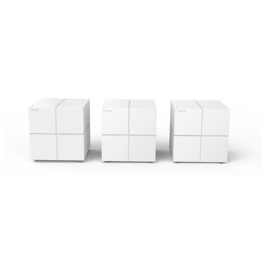
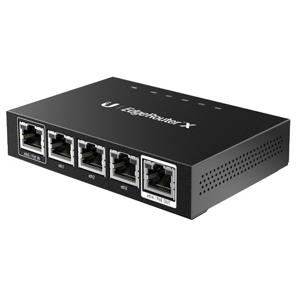
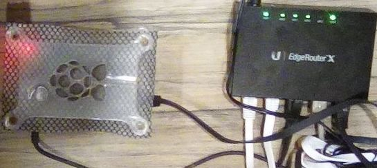

In the past five years or so, I've been using the netgear orbi at my home. It gave us incredible speeds in a mesh network, but it costs upwards of 600SGD for two units (one router and one satallite), and it just couldn't provide the cover I needed, nor could it daisy chain. Every time there was a firmware update, I had to restore factory settings and set up everything all over again. Definitely not a great experience. When my setup started dropping wifi connections every day, I needed a replacement, with better bang for my buck.

The solution seemed straight forward: research for a new consumer mesh setup, and buy one. I researched on many different brands and setups, and the one thing that came out consistently in all the reviews was: the orbi was the best product your money can buy (╯°□°）╯︵ ┻━┻

[Every](https://www.tomsguide.com/us/netgear-orbi,review-4263.html) [one](https://www.lifewire.com/netgear-orbi-review-4589368) [seemed](https://www.expertreviews.co.uk/netgear/1405475/netgear-orbi-rbk50-review) [to](https://www.techspot.com/products/routers/netgear-rbk50-rbr50-orbi-ac3000-tri-band-wifi.153730/) [be](https://www.mbreviews.com/netgear-orbi-home-wifi-system-review/) [bought](https://www.techradar.com/sg/reviews/netgear-orbi) off by netgear and yes, I considered that I might have been the minority and received a faulty unit, but the [community seems to agree with me](https://www.reddit.com/r/orbi/)

In the end I figured to just look for the cheapest mesh units money can buy. I found a chinese company called tenda, selling the m5 series with a set of [3 units under 200SGD](https://shopee.sg/Tenda-Nova-MW6-WiFi-Wireless-Router-and-Repeater-2.4G-5.0GHz-APP-Remote-Manage-i.41816358.2236310726) and read all the reviews for it. It seemed like it could output a maximum of 900Mbps which was sufficient for my needs, and there was little to no configurations for it. There's only a max of 2 cat5 ports but that was sufficient for most of my house, and I could always buy a desktop switch for the living room. The reviews also promised a plug and play but warned of almost no configuration flexibility. At that time it was also on sale for about 150SGD for a set of 3, hell yea.

I bought it and a desktop switch (also tenda, because it's cheap and just in case of compatibility issues), it arrived a week later. It did not work when connected with my modem. To be fair to tenda, connecting each mesh unit was as simple as starting up their proprietary app, and selecting each unit as they popped up on the screen. I found that I could get it to work if I connected my old router via lan to the tenda m5. This setup gave me about 600-900 Mbps but I had two different wifi endpoints, one working, one dying. 

This was good enough for me until my orbi started dropping lan too. Time to look for a gigabit router. This time, I wanted something that was tried and tested in Singapore. I looked through many different routers that promised gigabit speeds, but reading user reviews, it seemed like most cheap routers under a hundred had over inflated numbers. The WiFi could technically handle gigabit speed, but they were just using cheap rj45 connectors. WiFi was not my issue as I could continue to use the tenda m5 as my wifi access points.

I then started to look into enterprise solutions. I figured if the machine did not have WiFi, at least the money I spent on would be for the hardware. In came the Edge Router X.

At the comparitively low price of 85SGD, this little beast is rumored to be on the same level as gaming routers costing three times its price. It is essentially a network switch but with router software, and with hardware offloading introduced about 2 years ago in the firmware, it could handle gigabit speeds. Certain things were supposedly not accessible by the browser interface, but I felt I am fairly familiar with the Command Line at this point in my development career, what batter time than now to enter the world of enterprise routers? The only thing left was to see if it worked when paired with my modem.

To my dismay, few people in Singapore used the edge router x, in favor of the edge router lite, which is a router built from the ground up. Do not be fooled by tha naming though, the lite is almost twice the price of the x, and could handle higher speeds than the ER-X out of the box. Shoutout to [Jacob](https://twitter.com/jacobtyq/status/1182166814861611009) for letting me know his experience with the ER lite! However, I am a cheapskate. I bought the ER-X during shopee's recent 10.10 sale.

Like every other tech nerd, the first thing I did when using a new technology was to not read any documentation and use it. I connected my modem to the ER-X and connected my laptop to the ER-X, and typed in `192.168.1.1` into my browser. I was greeted by my good friend:

After actually reading some tutorials, I realised I had to connect my computer to eth0, set my laptop to request for a static IP (no default dhcp) and open the setup wizard (for noobs like me) to set up some basic configs. I applied all the default settings and changed the password of the default user. As part of the wizard and default settings, I had to disconnect my laptop from eth0 and connect to any other port, then connect my modem to eth0. I had some rx and tx going on the webgui, but I was not getting any internet. Dang. After some trial and error and about an hour of research, I found the solution to all things in tech support: turning everything off and on again. The key thing that made it work was restarting the modem, allowing my router to request a new IP from my ISP. Everything was working with minimal setup.

The last thing I had to do was to enable hardware offloading. I do not know what hardware offloading does. I have read all the tutorials and all the explanations and like all tech documentations, they went over my head, but all I know is: turn on hardware offloading, you lose QoS but gain gigabit speed. (Note: Edgerouter lite doesn't need to turn on hardware offloading to achieve gigabit speed) Activating these were simple enough: enter the CLI, log in, type `command` followed by `set system offload hwnat enable`, `set system offload ipsec enable` and `commit ; save`. Reboot the router and check from the cli with `show ubnt offload`. You can also do the same by fiddling with the GUI, but where's the fun in that.

Finally everything is up. Connecting my mesh routers to this router was seamless, as well as my smart tv and streaming boxes. Setting up port forwarding for my raspberry pi was as straight forward as any commercial router too. I haven't really managed to get gigabit speeds, but it is also an internet peak hour as of writing this article, I will probably need to check again in the middle of the night, but I am optimistic about the results.

All in all, ER-X is incredibly tiny for what it does and is comparitively cheap. Paired with the tenda m5, I have full coverage of my house, no uncessessary 2.4g or 5g noise from multiple routers and also reduce the clutter on my tv console. I cannot say that I am a network expert, but I think this setup is both affordable and performant. Having the flexibility to configure whatever the heck you want is a nice add on too. 

Special mention to [Ken Lee](https://twitter.com/kenleesm) and [Jonathan Lim](https://twitter.com/jonathanlimsc) who advised me on whether I really needed an enterprise grade router.

Update on measurements taken during off peak timings:

I am getting 300 Mbps on wifi while seated next to my first AP. Is this a stepdown from orbi's maxspeed? yes. Is this still fast enough for me? yes.