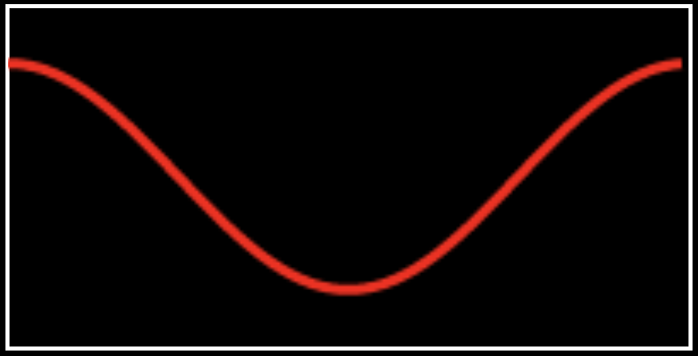
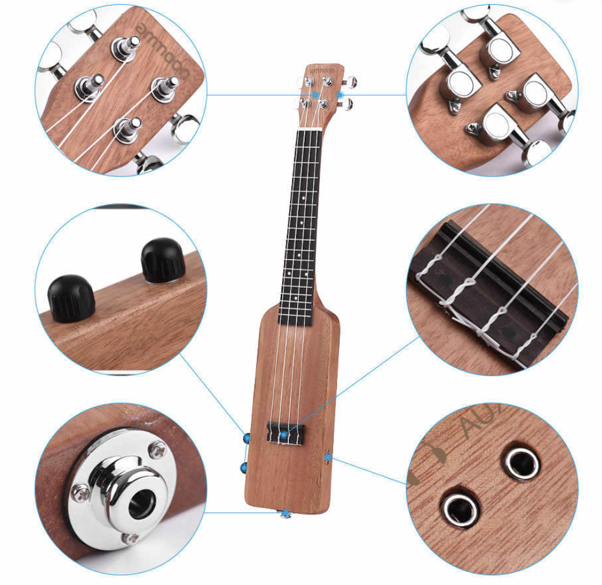
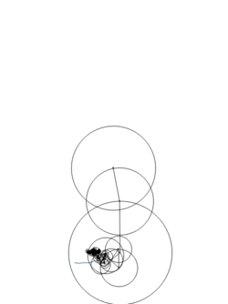
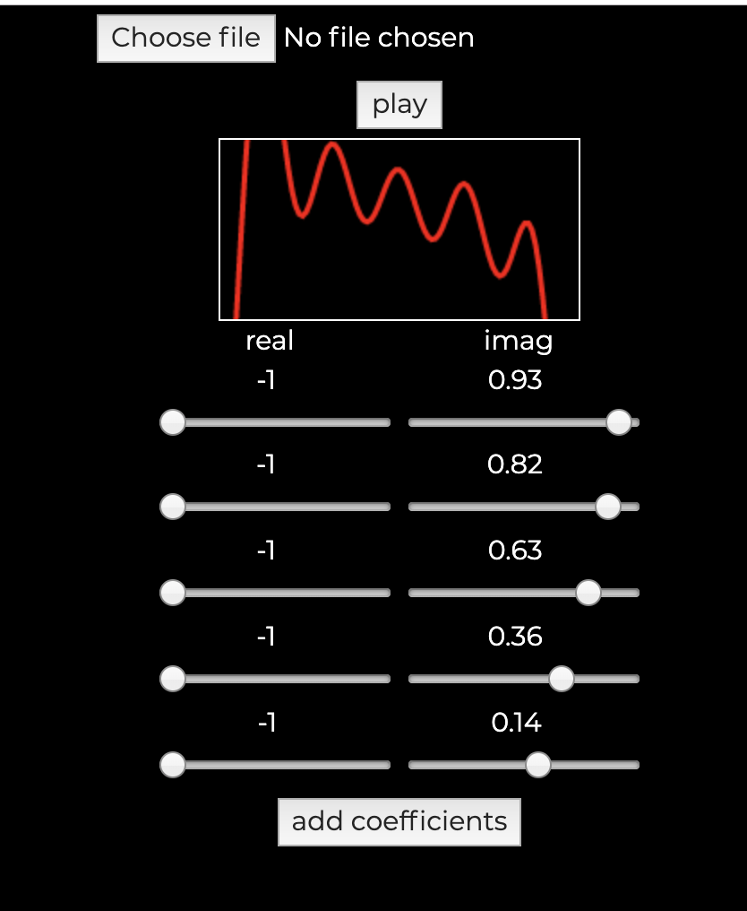
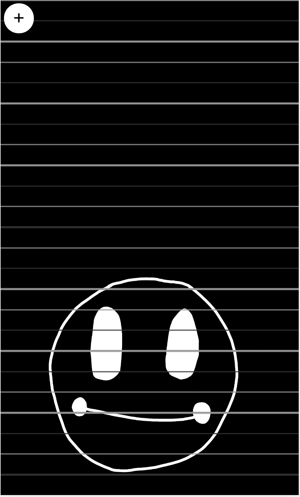

**This article is a complement to my presentation in React Knowledgable.**

Before we go into the specifics, I'd like to disclose that I am no musician. I make sounds on an ukulele and sometimes it sounds like music. Whatever music theory I know is from Youtube videos. I have a fascination with electric musical instruments, from things like my electric ukulele, to synthesizers like the theremin.


I always wanted to build my own synthesizer but I don't have the time nor the patience to learn the electronics to go behind one of those, So why not build one using software? I had a target instrument in mind, the `otamatone`. This instrument has a touch bar that determined what note you were playing, and you can vocalize things close to words with the silicone mouth. While I probably can't mimic the mouth of otamatone with software, I can definitely do things like have a touch interface that plays certain sound waves depending on where you touch.


## The science of music

In our early science education, we have learnt that sounds are vibrations that is sent through some medium (usually air) to our eardrums. The vibrations in our eardrums are then converted into electrical pulses and sent through our nerves. Here's a visualization of the vibration as it appears in real life.


However this isn't very useful for analysis so we represent these vibrations in the form of waves like so:



It should look familiar, that's the cosine wave that we've seen in math so often.  A musical note is the same as any other sound but vibrating consistently(ish) at certain frequencies. Scientifically, we will measure these frequencies using `hertz`. One `hertz` is equivalent to one complete cycle per second. So the above wave in 440 hertz (Hz) is basically 440 times of the above graph happening in a second.

So how do we define what is in tune and what is not? In fact, tuning is socially constructed and learnt. Things only sound in tune because we are trained to recognize the notes as being in tune. For the purpose of simplicity I'll use western system of music with 12 equally spaced (semi)tones in an octave (doh re mi all the way back to doh) for the rest of this article. [Adam Neely on Youtube](https://www.youtube.com/watch?v=H4KIwA8O9LU) goes into deeper details of tones in between the 12 tones still present in the ever popular lo-fi hip hop tunes.

Unless you have perfect pitch, many people are unable to identify what is in tune or not. In fact, we are so inconsistent that there's no universally agreed list of frequencies that are considered in tune. Even in western music, the concept of 12 equally spaced tones has been recently contested multiple times. It is, however very obvious when a certain note is played off key in relation to the others.

Where does that leave us? There is one universal truth though, that is given any root note, we can double the frequency and to us, it sounds like the same note, only higher. This is due to the wave start points and endpoints aligning every two cycles. In the case of 440Hz, we know that one octave higher is exactly 880Hz and one octave lower is 220Hz. Since we are using equally spaced tones, we can use [a formula I found from Michigan Technological University's site:](https://pages.mtu.edu/~suits/NoteFreqCalcs.html)

$$
f_n = f_0 * (a)^n
$$

where $f_0$ is a pre-defined root note and $n$ is the nth note from the root note. To figure out the constant $a$, we will use $a = 2^{\frac{1}{N}}$ where $N$ is the number of tones we want in an octave. Intuitively, we expect $a^n$ to be equal to 2 when $n = N$. Remember that an octave higher is just $f_0 * 2$.

## Notes in numbers

In the case of a physical musical instrument, like an electric ukulele for example, we can easily get the sound by recording vibrations through an electrical component like a pickup, there are many different type of pickups, and the one that's on my ukulele is over what we call the bridge. We don't have to worry about frequencies in such instruments as the pickup converts the vibrations into electrical pulses, these frequencies will be in tune as long as the instrument itself is in tune. 



When making a synthesizer, I can do two solutions: get a sample of every possible note my instrument needs to play, or generate my own electrical pulses to send to the speakers. We know that sound is generated via waves, so for my first prototype I just needed to play some note based on the y-coordinate of the user's touch event. The [audio context api](https://developer.mozilla.org/en-US/docs/Web/API/AudioContext) gives us gain and oscillator nodes to play with. So trying to just make a sound, let's have something like this.

```
// support for different browsers
let context = new (window.AudioContext || window.webkitAudioContext)();
let o, g;
let freq = 440;
let isPlaying = false;
function playNote() {
    // re-using an oscillator seems to result in noise being introduced into output
    o = context.createOscillator();
    g = context.createGain();

    // can be sine, square, sawtooth, triangle. defaults to sine
    o.type = sine;
    o.connect(g);
    g.connect(context.destination);

    // you can actually start in the middle of the wave
    // to manipulate the attack of the note
    // but this is not covered in the
    o.start(0);
    o.frequency.setValueAtTime(freq, context.currentTime);

    // flag to be used later
    isPlaying = true;
}

function stopNote() {
    // if a wave abruptly stops, there will be a "click" sound
    // even if we exponentially volume down for 40 ms it's good enough
    g.gain.exponentialRampToValueAtTime(
        0.00001, // api doesn't accept 0
        context.currentTime + 0.04,
    );
    
    setTimeout(function () {
        // if we don't stop, the garbage collector will not clean it up
        o.stop();
        isPlaying = false;
    }, 41); // as long as it's after the exponential ramp its ok
}
```

If we go back to our understanding of waves in mathematics, gain is basically a coefficient to the amplitude of the generated waves. This helps control the volume of the sound being played. To play different notes, we need to manipulate the frequency. Right now our code will default to 440 Hz, so if we're looking for 2 octaves range we need to find a way to map the y coordinate of the user between the range 440 and 1760. As value of hertz between notes do not scale linearly, we can make use of MTU's formula which works well with frequencies in between the semi tones. This allows us to pass in some number between 0 to 24 and it should work for 2 complete octaves.

```
const scaleHeight = (
        num,
        out_min = 0,
        out_max = 24, // semitones in 2 octaves
        in_min = 0,
        in_max = Math.max(document.documentElement.clientHeight, window.innerHeight || 0) //viewport height
    ) => {
    const scaleMap = (num - in_min) * (out_max - out_min) / (in_max - in_min) + out_min;

    const hertz = ROOT_NOTE * Math.pow(1.059463094359, scaleMap);
    return hertz; 
}
```

I found online that 440Hz is widely accepted as the frequency of a in the fourth octave. So I've sent the constant `ROOT_NOTE = 440` and the notes will be calculated in relation to that.

```
function setNote(newFreq) {
    // we want oscillator to be initialized when we change it
    if (isPlaying) {
        o.frequency.setValueAtTime(newFreq, context.currentTime);
    }
}
```

Now that we've got the notes playing, the resulting sine wave sounds quite like a recorder, so let's add some way to customize how it sounds.

## It's going down, I'm telling timbre

From wikipedia, timbre is what makes a particular musical sound have a different sound from another. In order to change the timbre, we need to change how the waves look like. Web audio api provides us a function `OscillatorNode.setPeriodicWave()` which accepts a periodicWave object that can be [created](https://developer.mozilla.org/en-US/docs/Web/API/BaseAudioContext/createPeriodicWave) using `AudioContext.createPeriodicWave(real, imag[, constraints]);`. In order to understand the inputs, we need to have a rough understanding of fourier series. 

The main concept we need to know is that all waves is either sinusoidal (derived from sine) or can be approximated from the summation of sinusoidal waves. All these waves can be represented in the form of fourier series



Looking at how the (non-normalised) waveform is generated from [the specifications](https://webaudio.github.io/web-audio-api/#waveform-generation):

Let a and b represent the `[real]` and `[imag]` arrays of length $L$ respectively. then the basic time-domain waveform, $x(t)$ can be computed using:
$$
x(t) = \sum^{L-1}_{k=1} [a[k]\cos 2\pi kt + b[k]\sin 2\pi kt]
$$

In english, what this means is that with $t$ from 0 to 1 (for one cycle), take `[real]` and `[imag]` of equal lengths and ignore the first value (for mathematical reasons I will not go through). We will then pass in all the other values in the array into the function above. To help myself visualize this function, I built [a tool](https://httpserve.tenzhiyang.com/fourierSeriesVis/) that draws the wave using this exact formula, and map out one complete cycle. We can also keep adding coefficients to the `real` and `imag` arrays and see how it affects the wave. I also added an audio context to play said wave that is being displayed.


Now with this tool, we can approximate how an otamatone's waveform looks like from [this excellent audio analysis of the otamatone](http://www.windytan.com/2017/11/in-pursuit-of-otamas-tone.html) by [@windyoona](https://twitter.com/windyoona). Of course by approximate I really mean making a wave, looking at it and then saying "ehh good enough" and that's it.



So all I have left to do is to put the generated wave array into my otamatone and presto! We have something that plays and sounds like the actual instrument. I've added a few quality of life features such as the ability to switch waves, and pitch correction (think of it like autotune). I call it the [otamaphone](https://httpserve.tenzhiyang.com/otamaphone)

